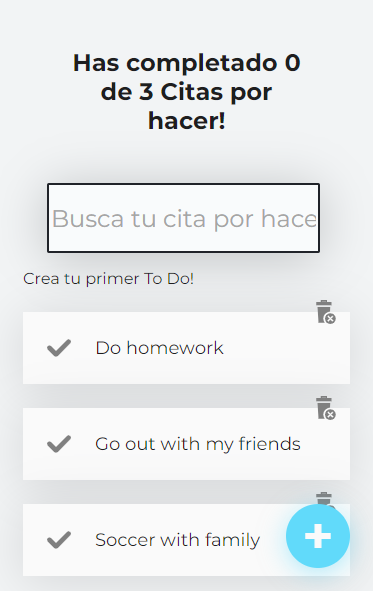

# Lego Website

## Welcome! 👋

This is a web app made with React.js where you can make a list of ToDo's and you can add, delete or complete them.

## Links!

  - Solution URL: https://mauricioc12.github.io/ToDo-React-Project/
  
## My process

Learn how to use React Hooks, LocalStorage and all of things involved with React.

## Built with: 

- React Js, React Hooks
- JavaScript
- Semantic HTML5 markup
- CSS custom properties, animations and transitions
- Responsive design
